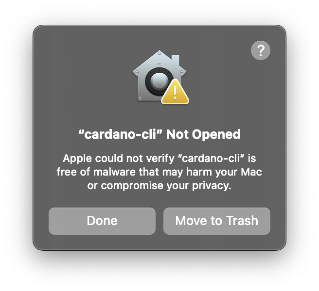
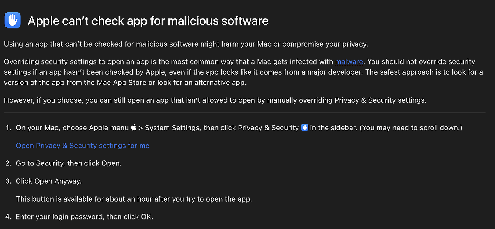
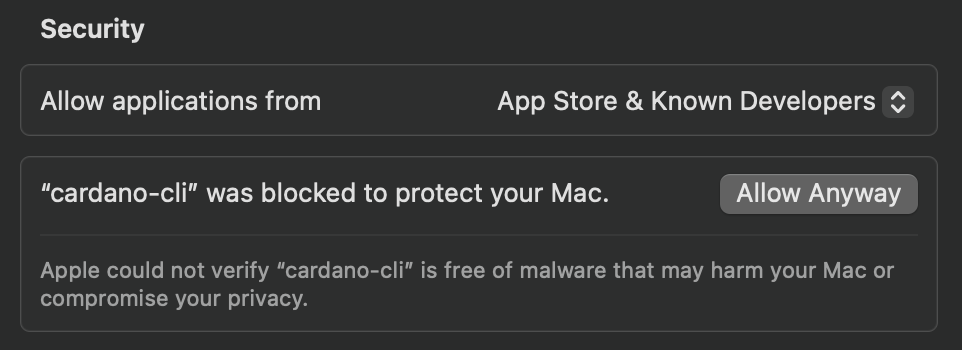

# HydraFactory

A local playground for Cardano Hydra setup and testing. Automate setup, manage wallets, and control Hydra heads through a simple web interface.

## Quick Start

```bash
npm install
npm run dev
```

Visit `http://localhost:3000` and follow the on-screen steps.

---

## What You Can Do

### 1. Cardano Node Setup

- **Download & install** Cardano binaries and configs with one click
- **Start/stop** your Cardano node automatically
- **Track progress** with live sync status and file checklists

### 2. Wallet Factory

- **Create wallets** instantly with one click
- **Fund wallets** via testnet faucets (links provided)
- **Split UTXOs** automatically for better transaction handling
- **Send ADA** between wallets directly from the UI

### 3. Hydra Nodes

- **Start/stop** all Hydra nodes with a single button
- **Monitor status** in real-time (online/offline, ports, connections)
- **Clear history** to reset node state when needed

### 4. Launch Hydra Head

- **Initialize** a new Hydra head with selected wallets
- **Commit UTXOs** to the head with visual selection
- **Send transactions** between parties inside the head
- **Close & fanout** to return funds to the main chain
- **Monitor everything** with real-time status, transaction logs, and charts

---

## Setup Steps

1. **Install dependencies**: `npm install`
2. **Download Cardano files**: Use the download buttons in the UI
3. **Start Cardano node**: Click "Start Cardano Node" button
4. **Create wallets**: Use Wallet Factory to generate test wallets
5. **Fund wallets**: Use testnet faucets (links in UI)
6. **Start Hydra nodes**: Click "Start All Nodes"
7. **Launch head**: Select wallets and click "Initialize"

All instructions, links, and commands are built into the interface—no external docs needed.

---

## Important Notes

- **Data storage**: All binaries and data are stored in `.cardano/`, `.hydra/`, and `.tmp/` (gitignored)
- **Wallet keys**: Stored in `.tmp/wallets/<id>/` — delete when done testing
- **Ports**: Hydra nodes use ports 4001, 4002, etc. (configurable)
- **Environment**: Run `setup-env.sh` if CLI commands fail

### Custom Hydra Scripts

By default, HydraFactory uses the official Hydra scripts deployed on preprod. To use your own custom Hydra validator scripts:

1. **Deploy your custom scripts** to Cardano (see [CUSTOM_HYDRA_SCRIPTS_GUIDE.md](./CUSTOM_HYDRA_SCRIPTS_GUIDE.md) for details)
2. **Set the environment variable** before starting:
   ```bash
   export CUSTOM_SCRIPTS_TX_ID="your-tx-id-1,your-tx-id-2,your-tx-id-3"
   npm run dev
   ```

Or edit `scripts/setup-env.sh` directly to change the `SCRIPTS_TX_ID`.

**Note**: Custom scripts must be compatible with `hydra-node`. See the [Custom Hydra Scripts Guide](./CUSTOM_HYDRA_SCRIPTS_GUIDE.md) for full instructions.

## Current Issues

**Committing UTXOs** is still a work in progress. If you encounter errors when committing a specific UTXO, try committing a different UTXO instead. This usually resolves the issue.

### macOS Security Warnings

If you see security warnings when trying to run Cardano CLI tools on macOS, you may encounter these dialogs:





**To fix this, you must allow anyway under Privacy and Settings in Mac:**

1. Go to **System Settings** > **Privacy & Security**
2. Scroll down to the **Security** section
3. You'll see a message that the app was blocked
4. Click **"Allow Anyway"** next to the blocked app
5. Enter your password when prompted
6. Try running the command again

This is required because Cardano CLI binaries are not signed by Apple, but they are safe to use.

---

## Troubleshooting

- **CLI fails** → Check that binaries exist in `.cardano/bin/` and you've run `setup-env.sh`
- **Hydra timeouts** → Verify nodes are online via the status cards
- **Node won't start** → Check if ports 4001, 4002 are already in use
- **Socket not found** → Ensure Cardano node is running
- **Commit errors** → Try committing a different UTXO (see Current Issues above)

---

## License

MIT License - see [LICENSE](LICENSE) file for details.

This project is fully open source. You're free to use, modify, and distribute it as you wish.
